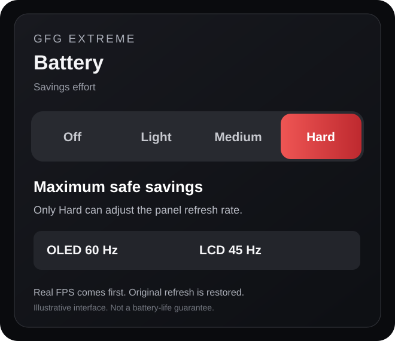

<div align="center">

**English** · [Русский](README.ru.md)


# GFG Extreme

### 90 FPS. Less power. Zero fiddling.

**Play anything on your Steam Deck as smooth as its screen allows** — up to 90 FPS on OLED, 60 on LCD.<br>
GFG Extreme generates the frames your game can't, holds the **lowest power that keeps the picture smooth**,<br>
and keeps adjusting while you play. Your Deck never burns a watt it doesn't need.

[**Download the latest release**](https://github.com/wavessevaw/GFG-Extreme/releases/latest) · [Quick start](#quick-start) · [Frame OS](#frame-os-experimental) · [Savings effort](#savings-effort) · [In-game rings](#in-game-rings) · [Something not working?](#something-not-working)


<br>

&nbsp;&nbsp;
&nbsp;&nbsp;


<sub>Home with Frame OS measured in game · Frame OS: A/B results and what it learned about this game · Illustrative new Battery Savings Effort card (Hard).</sub>

<br><br>


<sub>The in-game rings: the actual bitmap GFG draws into the game, on an illustrative scene.</sub>

</div>

---

## Why GFG Extreme

- **🎯 Smooth, not stuttery.** Up to **90 FPS on OLED** and 60 on LCD, even when the game renders 30. Generated frames fill the gap, and GFG picks the ratio that holds for *this* game, *this* scene.
- **🔋 Power only where it pays.** Instead of running flat out at the stock 15 W, GFG holds the **lowest TDP the game tolerates** — in Battery mode 9–11 W — and spends more only when a scene truly needs it. Cooler, quieter, longer sessions.
- **🧠 Set it once.** Press **Run**. No TDP sliders, FPS caps or frame-generation settings to babysit. GFG remembers every game and starts from what worked last time.
- **🔋 Pick the effort, not fictional hours.** Battery mode offers **Off / Light / Medium / Hard**. Source FPS is the safety signal, and the power ceiling is relaxed when a heavy game becomes unplayable.
- **🛡️ Picture first.** Every change is checked against the renderer's own frame data and **rolled back if it doesn't hold**. GFG never trades smoothness for watts behind your back.
- **⚡ Real frames when it matters.** **Frame OS** reads your controls: turn the camera or start a fight and it raises the *real* frame rate on the spot; pause, and it saves power.
- **📊 Proof, not promises.** Frame OS **measures its own benefit in your game** with in-game A/B checks, and switches off whatever doesn't pay off there.

Works with Steam games and, through Flatpak support, with Heroic, Lutris and emulators. Your saved settings are never touched: **Stop** puts everything back.

## New in 1.4

- **Battery savings effort (1.4.3).** Fixed-hour promises are gone. **Off** uses normal Battery optimization, **Light** makes a gentle extra saving, **Medium** uses a tighter power budget, and **Hard** also requests OLED 60 Hz or LCD 45 Hz if supported. The previous rate is restored on leaving Hard, unless the player moved Steam's refresh slider.
- **Since 1.3:** Frame OS checks itself in your game with A/B comparisons and remembers what works in every game; the pacer plans frames from the scene's cost trend; the in-game rings are drawn on every frame without flicker.

Full notes: [Releases](https://github.com/wavessevaw/GFG-Extreme/releases).

## What it does

<p align="center"></p>

**30 real frames, 90 on screen, 9 watts.** On a Steam Deck OLED the Governor might run a game at 30 rendered frames, generate the rest up to 90, and hold the APU at 9 W. If a scene gets heavier, it adds watts or generated frames within about two seconds. While the game holds, it tries one watt less every 45 seconds.

- **Knows your screen.** OLED → 90 FPS, LCD → 60 FPS, dock or external display → 60 FPS. Set the built-in screen to a lower refresh rate (an OLED at 60 Hz) and the target follows it.
- **Checks every change.** Each setting is confirmed on the renderer's own frame data and rolled back if it does not hold.
- **Remembers your games.** The next session starts from what worked last time instead of searching again, and the lowest TDP that held is kept when you switch between Battery and Balanced. **Settings → Diagnostics → Reset what GFG learned** makes one game start fresh.
- **Sees the machine.** Temperature, GPU and CPU load, frame-time spikes and battery draw. Home tells you in one line what limits the game, and the effort label says why GFG is working hard.
- **Steps aside for Steam's menu.** While the Steam menu covers the game, measuring pauses, so a menu never looks like a slow scene.
- **Tells you what you saved.** After a session Home shows the modes you used, the energy saved in Wh from the measured draw, and about how many minutes of battery that is.
- **Leaves your settings alone.** Your saved profile is never modified; Stop puts everything back. No overclocking, never above your Deck's power ceiling, and if another tool keeps changing TDP, GFG stops fighting it. If Steam's TDP helper does not answer in time, your own limit stays.

## Three modes

| | Real frames | Power | Pick it when |
|---|---|---|---|
| **Battery** | 24 or more | 9–11 W ideal, more only as a last resort | you want the longest play time |
| **Balanced** | 30 or more | starts at 12 W, never above the normal range | you want a steadier picture |
| **Quality** | as many as possible | lowered after quality is set | you are plugged in |

## Frame OS (experimental)

A small Vulkan layer that sits above the frame generator. It watches every real frame the game renders and what you do on the controls, and moves the real frame rate to match the moment. Find it in **Settings → Diagnostics → Frame OS**; it loads at the next game start.

### What it does

- **Observe** and **Shadow** only measure and show what Frame OS *would* do.
- **Act** (tap *Unlock Act*, then tap again to confirm) changes the game's frame timing and power:
  - **Turning the camera or fighting:** more real frames — ×3 becomes ×2, 45 real frames at 90 Hz — when the GPU can deliver them. The boost starts on the onset of a camera swing.
  - **Pauses, menus, AFK:** lower TDP, and ×4 where the renderer can generate it.
  - **Just in time:** real frames are paced so they wait much less inside the frame generator before you see them (measured on a Deck: about 25 ms down to about 13 ms). The pacer plans each frame from the scene's cost *trend*, so a scene getting heavier does not cost missed frames.
  - **Rests** the moment the Steam menu covers the game, and hands control back to the Governor when the APU gets hot or the output falls short.

Home gets a **Frame OS card** with three rings — **Response**, **Frames** and **Energy** — coloured from red (worse) through orange and yellow to green (a lot).

### It checks itself in your game

<p align="center"></p>

Estimates are not proof. In Act, every so often Frame OS switches **one** of its effects off for a few seconds and compares the same moment before, during and after (A-B-A), so heat or a heavier scene cannot fake the result. The moment decides the test: calm play checks **Response**, a fight checks **Frames**, a pause checks **Energy** from the measured APU draw.

After three comparisons a ring shows the **measured** number. The card says *Measured in game*, the overlay shows `A/B` while a check runs, and Diagnostics lists every result with its 95 % range. Checks are short and rare, never count toward the session numbers and never add watts; one switch turns them off.

### It learns every game

What the checks measured carries over to the next session of the same game, so its rings start measured and the checks get rarer. When an effect **hurts** in a game — or a boost brings **no real frames** because the GPU is already at its limit — Frame OS switches it off **for that game** and says so on Home and in Diagnostics (*This game*). Every eight sessions it gives a switched-off effect a fresh try, in case a patch or new settings changed the game. **Reset what GFG learned** clears it.

## Savings effort

Savings effort is an additional control shown **only when Battery mode is selected**. It does not appear in Balanced or Quality, and **it does not promise a number of battery hours**.

| Effort | Battery power policy | Internal display |
| --- | --- | --- |
| **Off** | Normal Battery Governor, no extra cap | No display change |
| **Light** | Soft 14 W APU ceiling; 10 W minimum for economy search | No display change |
| **Medium** | Soft 12 W ceiling; 9 W minimum | No display change |
| **Hard** | Soft 11 W ceiling; 9 W minimum, released as necessary to maintain real-frame playability | **OLED 60 Hz**, **LCD 45 Hz**, only when supported |

The Governor still has its own guarded search, FPS confirmation, power ownership and rollback. Savings effort cannot make 10 real FPS acceptable by generating 30 output FPS. When confirmed real-frame evidence shows a sustained collapse under a binding savings cap, GFG raises its playable power floor and can lift that cap. The cap figures are policies, not an assertion that each game can achieve its FPS target at those watts.

Hard uses Gamescope's same refresh control as the Deck's target-FPS setting. It verifies that the exact display mode was applied, remembers the prior rate and restores it on exit. It never changes an external monitor. Manual changes to the Steam refresh slider take priority; a failed or unsupported switch is reported rather than silently pretending success.


<sub>Illustrative UI card, not measured gameplay performance.</sub>

## In-game rings

<p align="center"></p>

The Home screen, shrunk into the corner of your game: a brand-red **FPS** ring with the real frame rate under it, a **TDP** ring, **battery** time in Detailed, and — with Frame OS on — the **Response / Frames / Energy** rings, coloured exactly like on Home. The ring that matches what Frame OS is doing right now is bright; the others dim.

With Frame OS Act, a badge says what is happening: **CALM**, **REST**, **VERIFYING**, **BOOST 45R x2** (only once fresh frame data shows the extra real frames) or **A/B** during a check.

- On by default in the **bottom-left corner**; **Settings → In-game overlay** picks Rings or Text, Minimal / Standard / Detailed and the corner.
- Refreshes **once a second**; unchanged pictures are reused. A frame waits for the overlay only when both of its image's copy slots are still busy, and then for at most 2 ms.
- Drawn by GFG's own small Vulkan layer after the frame generator. It needs one game restart after you first pick it; until then, in Flatpak apps and in HDR games you get the classic text line:

`90 FPS  x3  (30)  sc100  TDP 9W  APU 8W  2h32  easy` — frames on screen, multiplier, real frames, render scale, TDP limit and measured APU draw, battery time left, how hard GFG is working, plus the Frame OS decision (`FOS boost 45`).


## After you play

<p align="center"></p>

When the game closes, Home sums the session up in rings: **average FPS**, **average real frames** and **average TDP**, and — if Frame OS ran — its **Response / Frames / Energy** payoff. Below them: how long you played, the time in each mode (and in each Frame OS state), and the energy saved against your limit — in Wh from the measured draw and as minutes of battery. **Details** keeps your recent sessions.

## Quick start

You need [Decky Loader](https://decky.xyz/) and [Lossless Scaling](https://store.steampowered.com/app/993090/Lossless_Scaling/) from Steam (the default public version).

1. Download the newest `GFG-Extreme-v*.zip` from [Releases](https://github.com/wavessevaw/GFG-Extreme/releases/latest) and install it in Decky (*Install from zip*). Accept the root access request — it is used only to set TDP.
2. Open GFG Extreme and tap **Install engine**.
3. In Steam, open the game's **Properties → Launch Options** and paste:
   ```text
   /home/deck/.local/bin/gfg %command%
   ```
   (GFG shows the command with a **Copy** button when a game is not attached yet.)
4. Start the game and press **Run**.

Heroic, Lutris, EmuDeck and other Flatpak apps: **Settings → System**, enable GFG for the app. Updating: install the new zip over the old one; settings, profiles and what GFG learned are kept. Restart a running game so the new layers load.

## Something not working?

<p align="center"></p>

1. **Settings → Diagnostics → Check setup.** One tap checks the engine, the launcher, the overlay, the diagnostics log and TDP access, and says what to fix for each failed item.
2. **Record a log.** Settings → Diagnostics → **Record log**, play for a minute, **Stop**. A zip lands on the Steam Deck desktop with a plain-language `summary.txt` on top. With Frame OS on, the log also says whether the game loaded the layer and breaks its measurements down per decision. [Open an issue](https://github.com/wavessevaw/GFG-Extreme/issues) and attach it.

## Status

**Stable (1.4.3).** Frame OS is experimental and off unless you turn it on. Every release is covered by an automated test suite (Python backend, the generated launcher run in bash, the interface rendered in a headless browser) and checked on a real Steam Deck. Logs from more games and setups are very welcome. Known limitations: [docs/GFG_GOVERNOR_KNOWN_LIMITATIONS.md](docs/GFG_GOVERNOR_KNOWN_LIMITATIONS.md).

<details>
<summary><b>Everything else it can do</b></summary>

- Per-game profiles, picked automatically by Steam app ID or process name.
- Frame generation by **GFG Engine**, **OptiScaler**, **the game's own** or **Off**; spatial scaling and vkBasalt shaders independent of it. With an external backend GFG only watches.
- **Pipeline Inspector**: Saved vs. Effective vs. Governor vs. what the running process actually loaded.
- **Configuration Journal** with safe restore, and **All settings** for every engine option.
- Gamescope WSI compatibility, MangoHud, Flatpak runtime extensions and per-app access.

</details>

<details>
<summary><b>For developers</b></summary>

```bash
npm ci
npm test              # backend tests, frontend build, frontend smoke test
npm run build         # frontend/ → dist/index.js (CI fails if it is stale)
npm run screenshots   # re-render docs/img from the real interface
python3 tools/gfg_log_report.py <log.zip>   # read a recorded log on a PC
```

Docs: [Governor architecture](docs/GFG_GOVERNOR_ARCHITECTURE.md) · [Telemetry](docs/GFG_TELEMETRY_CAPABILITIES.md) · [Interface](docs/GFG_UI_REDESIGN.md) · [Frame OS](docs/GFG_FRAME_OS.md). Every merge to `main` with a new version publishes a release automatically (0.x as pre-releases, 1.0.0 and later as official releases).

</details>

## Credits

GFG Extreme continues the **MAKO** and **lsfg-vk** work: it succeeds [Decky LSFG-VK Experimental](https://github.com/eugeniosegala/decky-lsfg-vk-experimental), and the bundled engine derives from the MAKO project that brings LSFG frame generation, spatial scaling and shader effects to Linux. Thank you to their authors. GFG Extreme does not contain or distribute Lossless Scaling; upstream `mako-*` names are kept where renderer compatibility needs them.

GPL-3.0-or-later · [License](LICENSE.md) · [Third-party notices](THIRD_PARTY_NOTICES.md)
