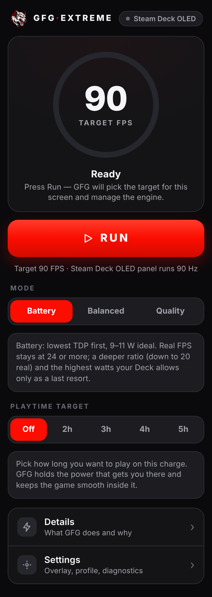
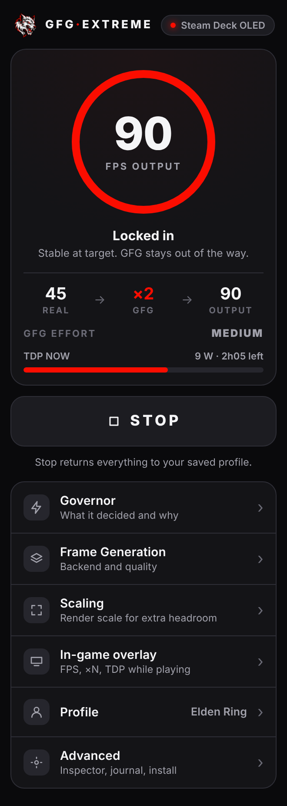
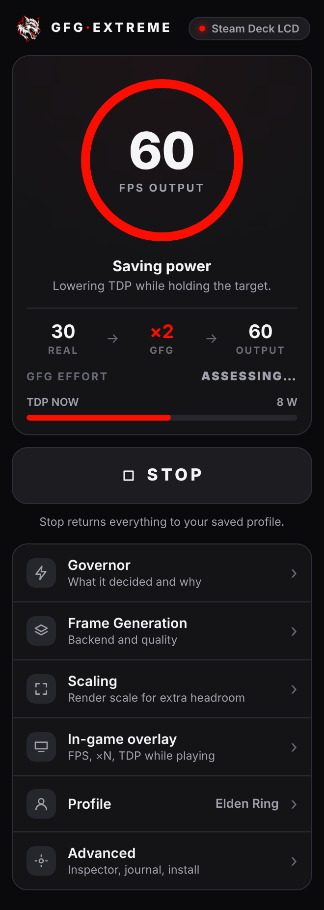
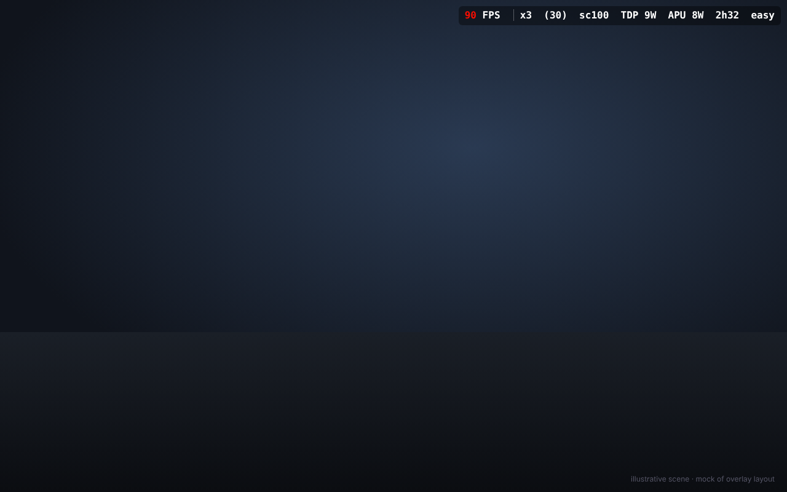

<div align="center">

**English** · [Русский](README.ru.md)


# GFG Extreme Decky

**Press Run. Get smooth, efficient frames on Steam Deck.**

Frame generation, smart scaling and TDP savings, orchestrated for you by the **GFG Governor**.


</div>

---

## Why it's great

Most frame-generation tools hand you a wall of switches and leave you to guess. **GFG Extreme Decky does the opposite: one beautiful screen and one Run button.**

| | |
|---|---|
| **One button** | Press **RUN**. The Governor reads your device, picks the target, starts the engine and manages it while you play. |
| **Knows your screen** | **Steam Deck OLED → 90 FPS**, **Steam Deck LCD → 60 FPS**, **Dock / external display → 60 FPS**. No manual tuning. |
| **Mostly does nothing** | It tries the highest-quality setting first (native first, then fractional ×1.25 to ×2.75 in quarter steps, x2 with a reduced render scale before the heaviest generation, and ×3 at most; never ×4/×5), checks the result on real renderer data, and **stops** once the target is held. No constant tinkering. |
| **Saves battery** | Once the target is stable it lowers TDP step by step while the frame rate holds, and shows you the estimated time left. |
| **Never touches your profile** | Your saved profile is **never modified**. The Governor works through a temporary overlay and always restores the original state. |
| **Safe by design** | No overclocking, no raising your power ceiling, never ×4/×5 automatically, and it backs off when another tool owns TDP or the pipeline. |
| **Honest effort rating** | **GFG Effort** (Easy · Medium · Hard · Nightmare) tells you how hard the engine is working, and is withheld until it's stable, so it doesn't flicker. |
| **Compact in-game overlay** | A single slim bar: FPS, frame time, multiplier, real → output FPS, render scale, TDP, battery time, effort. |
| **Everything is still there** | Profiles, per-game rules, Flatpak support, Pipeline Inspector, Configuration Journal and every engine option remain one tap away under *Advanced*. |

## A look inside

<div align="center">
<table>
<tr>
<td align="center"><br><sub><b>Ready</b> · target picked for your screen</sub></td>
<td align="center"><br><sub><b>Locked in</b> · real → ×2 → output, TDP, effort</sub></td>
<td align="center"><br><sub><b>LCD</b> · 60 FPS target, saving power</sub></td>
</tr>
</table>
</div>

> Screenshots are UI previews rendered with sample data in a mock Decky environment, not captures from a running Deck.

### In-game overlay

One compact line, top right, just the numbers that matter:

<div align="center">

</div>

`90 FPS  x2  (45)  sc100  9W  2h05  med`
(FPS with generated frames, multiplier, real FPS, render scale, TDP, time left, effort; MangoHud's own FPS and frame time appear only while the Governor has no renderer telemetry)

Choose **Minimal**, **Standard** or **Detailed**, and put it where you like. No CPU load clutter.

## How the Governor thinks

1. **Detect** the device (OLED, LCD, Dock) and choose the target.
2. **Measure** the real frame rate from engine telemetry. Nothing is changed yet.
3. **Try** operating points from best quality downward, each one **confirmed on real data** before it's kept and **rolled back** if it isn't.
4. **Lock** the first point that holds the target, then **trim TDP** while it stays healthy.
5. **Guard** against quality dips; release everything cleanly on Stop, game exit or profile change.

It is bounded (a fixed number of attempts, no ping-pong) and every decision is written to a journal you can inspect.

## Targets

| Mode | Target |
|---|---|
| Steam Deck OLED | **90 FPS** |
| Steam Deck LCD | **60 FPS** (the panel tops out at 60 Hz) |
| Dock / external display | **60 FPS** |

## Install and use

Requires [Decky Loader](https://decky.xyz/) on SteamOS, and the **default public version** of [Lossless Scaling](https://store.steampowered.com/app/993090/Lossless_Scaling/) from Steam for frame generation or LS1 scaling.

1. Install the GFG Extreme Decky ZIP through Decky Loader.
2. Open GFG Extreme and select **Install engine** (the ZIP alone does not install it).
3. Set the Steam launch option of your game to:

```text
/home/deck/.local/bin/gfg %command%
```

4. Start the game and press **RUN**. GFG attaches to the running game; only a game started before this version (or without the launch command) needs one relaunch.

The old `mako-run` command keeps working as an alias. For Heroic, Lutris, EmuDeck and other Flatpak apps, open **Advanced → System** and enable GFG for the app (it prepares the runtime extension and access for you).

## Everything else

- Per-game and per-process **profiles**, selected automatically by Steam app ID or process name.
- Frame generation through **GFG Engine**, **OptiScaler**, **Game Native** or **Off**, with Spatial Scaling and Shaders independent. External backends are **observe-only**, the Governor never fights them.
- **Pipeline Inspector**: compares *Saved*, *Effective*, *Governor runtime* and *Actual* launch state, verified against the live process.
- **Configuration Journal** with schema-safe restore.
- Gamescope WSI compatibility, MangoHud, bundled vkBasalt shaders (sharpening, anti-aliasing, lighting).
- Flatpak runtime extensions and per-app access.

## Status

**Beta (Governor v0.0.10).** The decision engine, overlay handling and safety rules are covered by an automated test suite (including tests that run the real generated launch wrapper in bash). Hardware validation on real Steam Decks is scheduled for the v0.0.10 integration release, so expect rough edges. Known limitations are listed in the release notes.

## Heritage and credits

GFG Extreme Decky is a **continuation of the MAKO and LSFG work**: it succeeds [Decky LSFG-VK Experimental](https://github.com/eugeniosegala/decky-lsfg-vk-experimental) under a separate product and package identity, and the bundled engine derives from the MAKO community project bringing LSFG frame generation, spatial scaling and shader effects to Linux. Huge thanks to the authors of MAKO and lsfg-vk.

GFG Extreme does not contain or distribute Lossless Scaling. Upstream `mako-*` filenames, Vulkan layer identifiers, configuration paths and RPC names are kept where changing them would break renderer compatibility.

## Documentation

[Governor architecture](docs/GFG_GOVERNOR_ARCHITECTURE.md) · [Telemetry capabilities](docs/GFG_TELEMETRY_CAPABILITIES.md) · [Known limitations](docs/GFG_GOVERNOR_KNOWN_LIMITATIONS.md) · [UI redesign notes](docs/GFG_UI_REDESIGN.md)

## Development

```bash
npm run test        # backend tests + frontend build + frontend smoke test
npm run build       # frontend/ → dist/index.js
npm run screenshots # re-render the UI previews
```

The interface source lives in [`frontend/`](frontend/) (no runtime npm dependencies, it uses the globals Decky provides). Licensed under GPL-3.0-or-later; see [LICENSE](LICENSE.md) and [third-party notices](THIRD_PARTY_NOTICES.md).
