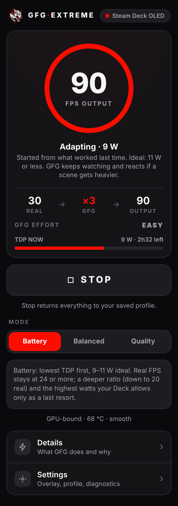
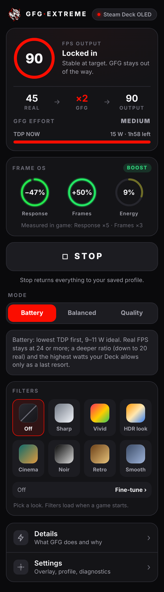
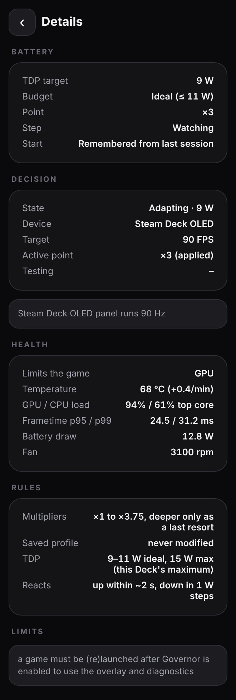
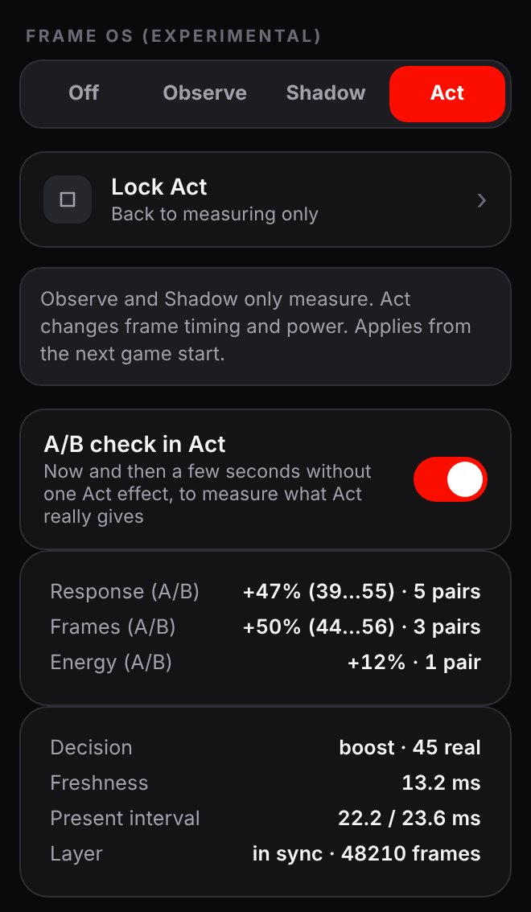
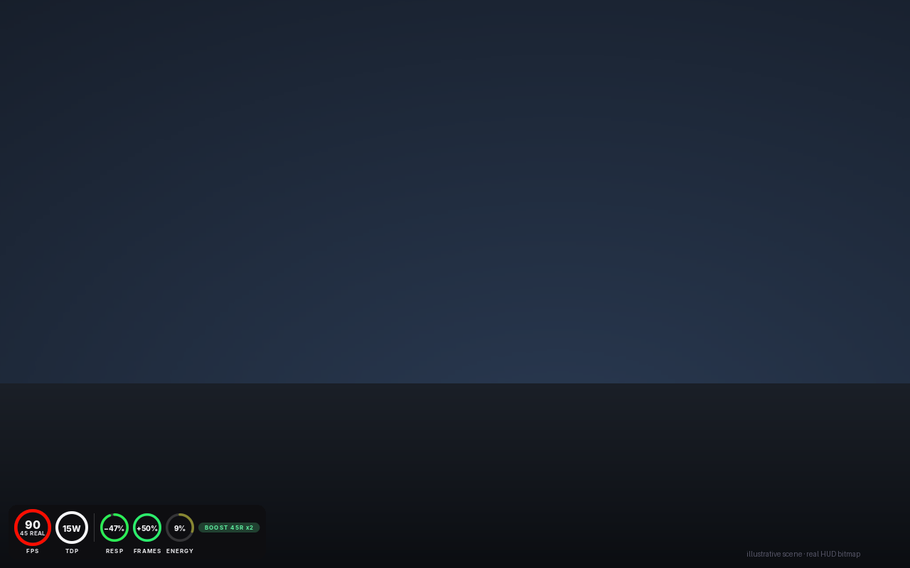
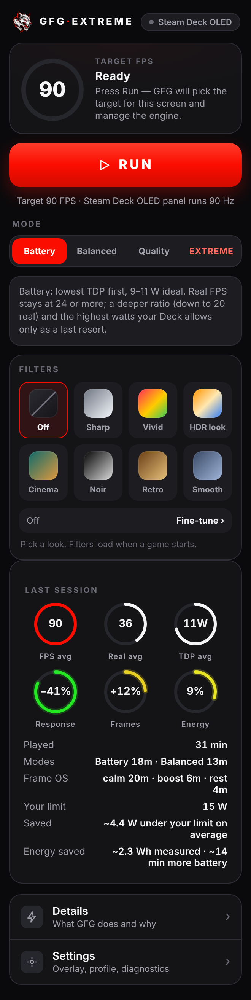
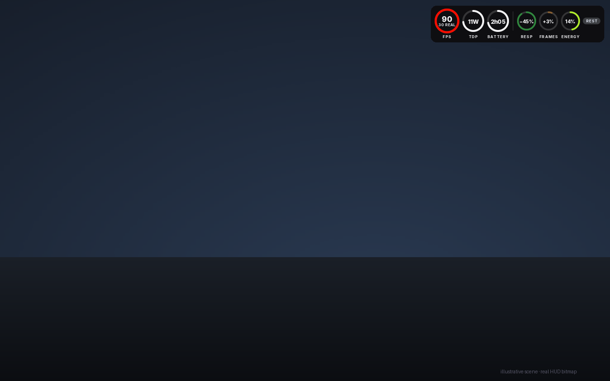
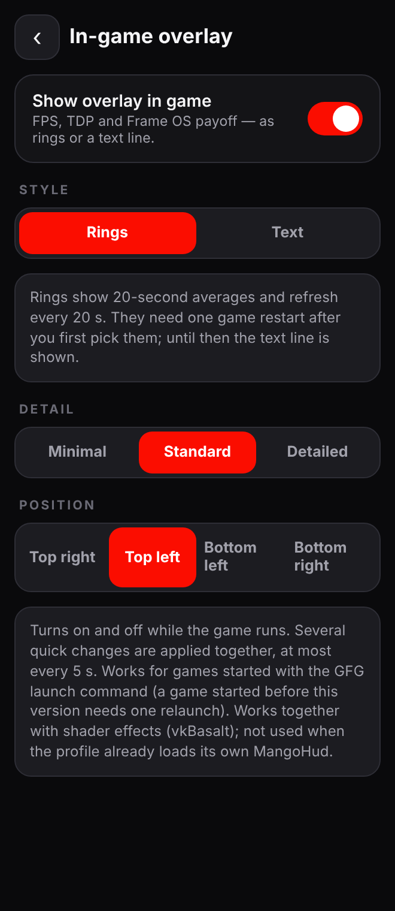
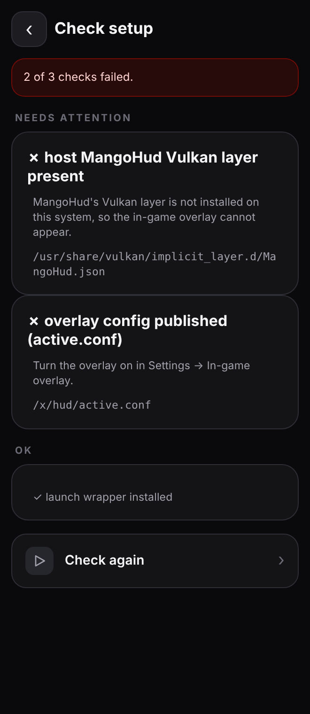

<div align="center">

**English** · [Русский](README.ru.md)


# GFG Extreme

### Frame generation that manages itself on Steam Deck.

Press **Run**. GFG picks the frame rate for your screen, chooses how many frames to generate,<br>
and sets the TDP as low as the game allows — then keeps adjusting while you play.<br>
New in 1.2: **Frame OS** (experimental) gives you more real frames when you act and saves power when you don't,<br>
and the in-game overlay turns into **rings**.

[**Download the latest release**](https://github.com/wavessevaw/GFG-Extreme/releases) · [Quick start](#quick-start) · [Frame OS](#frame-os-experimental) · [Something not working?](#something-not-working)


<br>

&nbsp;&nbsp;
&nbsp;&nbsp;


<sub>Home while playing · Home with Frame OS acting · Details. Rendered from the real interface with sample data.</sub>

</div>

---

## What it does

**30 real frames, 90 on screen, 9 watts.** On a Steam Deck OLED the Governor might run a game at 30 rendered frames, generate the rest up to 90, and hold the APU at 9 W. If a scene gets heavier, it adds watts or generated frames within about two seconds. While the game holds, it tries one watt less every 45 seconds.

- **Knows your screen.** OLED → 90 FPS, LCD → 60 FPS, dock or external display → 60 FPS. Set the built-in screen to a lower refresh rate (an OLED at 60 Hz) and the target follows it.
- **Checks every change.** Each setting is confirmed on the renderer's own frame data and rolled back if it does not hold.
- **Remembers your games.** The next session starts from what worked last time instead of searching again, and the lowest TDP that held is kept when you switch between Battery and Balanced. **Settings → Diagnostics → Reset what GFG learned** makes one game start fresh.
- **Sees the machine.** Temperature, GPU and CPU load, frame-time spikes and battery draw. Home tells you in one line what limits the game, and the effort label says why GFG is working hard.
- **Steps aside for Steam's menu.** While the Steam menu covers the game, measuring pauses, so a menu never looks like a slow scene.
- **Tells you what you saved.** After a session Home shows the modes you used, the energy saved in Wh from the measured draw, and about how many minutes of battery that is.
- **Leaves your settings alone.** Your saved profile is never modified; Stop puts everything back. No overclocking, never above your Deck's power ceiling, and if another tool keeps changing TDP, GFG stops fighting it. If Steam's TDP helper does not answer in time, your own limit stays.

## Three modes

| | Real frames | Power | Pick it when |
|---|---|---|---|
| **Battery** | 24 or more | 9–11 W ideal, more only as a last resort | you want the longest play time |
| **Balanced** | 30 or more | starts at 12 W, never above the normal range | you want a steadier picture |
| **Quality** | as many as possible | lowered after quality is set | you are plugged in |

## Frame OS (experimental)



A small Vulkan layer that sits above the frame generator. It watches every real frame the game renders and what you do on the controls, and moves the real frame rate to match. Find it in **Settings → Diagnostics → Frame OS**; it loads at the next game start.

- **Observe** and **Shadow** only measure. The in-game overlay shows what Frame OS would do (`FOS boost? 45`).
- **Act** (tap *Unlock Act*, then tap again to confirm) changes the game's frame timing and power:
  - **Turning the camera or fighting:** more real frames — ×3 becomes ×2, 45 real frames at 90 Hz — when the GPU can deliver them.
  - **Pauses, menus, AFK:** lower TDP, and ×4 where the renderer can generate it.
  - **Just in time:** real frames are paced so they wait much less inside the frame generator before you see them. Measured on a Deck: about 25 ms down to about 13 ms.
  - **Learns** when a boost does not help in a game and stops paying for it.
  - **Rests** the moment the Steam menu covers the game, and hands control back to the Governor when the APU gets hot or the output falls short.

Home gets a **Frame OS card** with three rings — **Response**, **Frames** and **Energy** — showing this session's benefit in percent, coloured from red (worse) through orange and yellow to green (a lot). In Observe and Shadow they are grey estimates. The same rings sit in the in-game overlay, next to FPS and TDP.

<br clear="right">



## After you play



When the game closes, Home sums the whole session up in rings: **average FPS**, **average real frames** and **average TDP**, and — if Frame OS ran — its **Response / Frames / Energy** payoff for the session. Below them: how long you played, the time in each mode (and in each Frame OS state), and the energy saved against your limit — in Wh from the measured draw and as minutes of battery.

<br clear="right">

## Quick start

You need [Decky Loader](https://decky.xyz/) and [Lossless Scaling](https://store.steampowered.com/app/993090/Lossless_Scaling/) from Steam (the default public version).

1. Download `GFG-Extreme-v1_2_3.zip` (or newer) from [Releases](https://github.com/wavessevaw/GFG-Extreme/releases) and install it in Decky (*Install from zip*). Accept the root access request — it is used only to set TDP.
2. Open GFG Extreme and tap **Install engine**.
3. In Steam, open the game's **Properties → Launch Options** and paste:
   ```text
   /home/deck/.local/bin/gfg %command%
   ```
   (GFG shows the command with a **Copy** button when a game is not attached yet.)
4. Start the game and press **Run**.

Heroic, Lutris, EmuDeck and other Flatpak apps: **Settings → System**, enable GFG for the app.

## The in-game overlay





**What the rings actually mean:** **FPS/90** (or **FPS/60**) identifies the output frame rate and its 90 (or 60) FPS target; the small `REAL` number under it is the actual source frame cadence (for example `90` and `30 REAL` suggest about ×3 output). **TDP CAP** is the configured power limit, *not* measured power draw. Detailed adds battery time. With Frame OS enabled, **AGE EST** is a model-based frame-freshness proxy (not measured input-to-photon latency), **REAL +** is the change in source-frame cadence relative to calm periods (or a grey plan in Observe/Shadow), and **CAP CUT** is the reduction in the configured TDP ceiling (not measured battery savings). The three percentages have *different baselines*; comparing their ring lengths is meaningless. `—` means unavailable, not zero. The label `OBSERVE EST`/`SHADOW EST` identifies modeled values; `ACT WAIT` means the executor has not confirmed active operation.

When experimental Frame OS Act is enabled, Standard and Detailed Rings also show **CALM**, **VERIFYING**, or **BOOST 45R x2** using live FPS and a pacer acknowledgement. **BOOST** requires measured real-frame improvement and an active executor. This badge does not establish input-to-photon latency or battery savings.

Rings refresh **once a second** from recent renderer telemetry. Identical images are reused, and rounded panels, ring geometry and glyphs are cached. Missing or stale FPS is shown as unavailable. The Vulkan layer skips a busy HUD copy rather than waiting for it during presentation.

**Rings are enabled by default in the bottom-left corner** on new installs and profiles that have never set an overlay preference. Existing explicit Off and other positions are preserved. Change the style, detail and position in **Settings → In-game overlay**. Rings are drawn by GFG's own small Vulkan layer after the frame generator; they need one game restart after you first pick them, and until then (or in Flatpak apps and HDR games) you get the classic text line:

<br clear="right">

`90 FPS  x3  (30)  sc100  TDP 9W  APU 8W  2h32  easy` — frames on screen, multiplier, real frames, render scale, TDP limit and measured APU draw, battery time left, how hard GFG is working, plus the Frame OS decision (`FOS boost 45`).

## Something not working?



1. **Settings → Diagnostics → Check setup.** One tap checks the engine, the launcher, the overlay, the diagnostics log and TDP access, and says what to fix for each failed item.
2. **Record a log.** Settings → Diagnostics → **Record log**, play for a minute, **Stop**. A zip lands on the Steam Deck desktop with a plain-language `summary.txt` on top. With Frame OS on, the log also says whether the game loaded the layer and breaks its measurements down per decision. [Open an issue](https://github.com/wavessevaw/GFG-Extreme/issues) and attach it.

<br clear="right">

## Status

**Stable (1.2).** Frame OS is experimental and off unless you turn it on. Every release is covered by an automated test suite (Python backend, the generated launcher run in bash, the interface rendered in a headless browser) and checked on a real Steam Deck. Logs from more games and setups are very welcome. Known limitations: [docs/GFG_GOVERNOR_KNOWN_LIMITATIONS.md](docs/GFG_GOVERNOR_KNOWN_LIMITATIONS.md).

<details>
<summary><b>Everything else it can do</b></summary>

- Per-game profiles, picked automatically by Steam app ID or process name.
- Frame generation by **GFG Engine**, **OptiScaler**, **the game's own** or **Off**; spatial scaling and vkBasalt shaders independent of it. With an external backend GFG only watches.
- **Pipeline Inspector**: Saved vs. Effective vs. Governor vs. what the running process actually loaded.
- **Configuration Journal** with safe restore, and **All settings** for every engine option.
- Gamescope WSI compatibility, MangoHud, Flatpak runtime extensions and per-app access.

</details>

<details>
<summary><b>For developers</b></summary>

```bash
npm ci
npm test              # backend tests, frontend build, frontend smoke test
npm run build         # frontend/ → dist/index.js (CI fails if it is stale)
npm run screenshots   # re-render docs/img from the real interface
python3 tools/gfg_log_report.py <log.zip>   # read a recorded log on a PC
```

Docs: [Governor architecture](docs/GFG_GOVERNOR_ARCHITECTURE.md) · [Telemetry](docs/GFG_TELEMETRY_CAPABILITIES.md) · [Interface](docs/GFG_UI_REDESIGN.md) · [Frame OS](docs/GFG_FRAME_OS.md). Every merge to `main` with a new version publishes a release automatically (0.x as pre-releases, 1.0.0 and later as official releases).

</details>

## Credits

GFG Extreme continues the **MAKO** and **lsfg-vk** work: it succeeds [Decky LSFG-VK Experimental](https://github.com/eugeniosegala/decky-lsfg-vk-experimental), and the bundled engine derives from the MAKO project that brings LSFG frame generation, spatial scaling and shader effects to Linux. Thank you to their authors. GFG Extreme does not contain or distribute Lossless Scaling; upstream `mako-*` names are kept where renderer compatibility needs them.

GPL-3.0-or-later · [License](LICENSE.md) · [Third-party notices](THIRD_PARTY_NOTICES.md)
