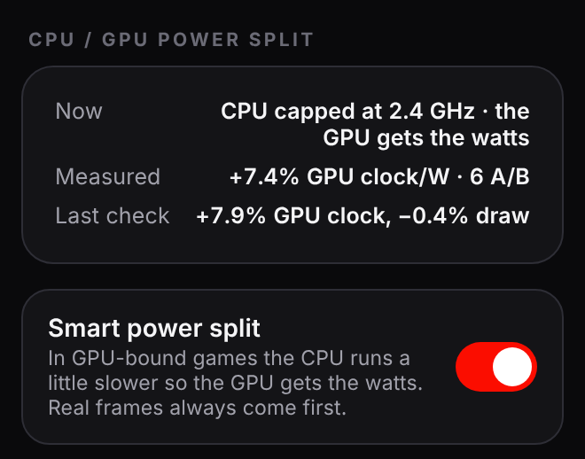
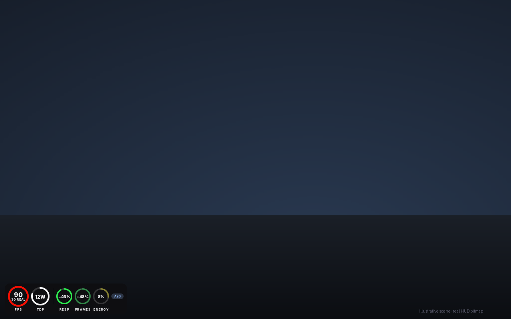

<div align="center">

[English](README.md) · **Русский**


# GFG Extreme

### 90 FPS. Меньше энергии. Никакой возни.

**Играйте во что угодно на Steam Deck так плавно, как позволяет экран** — до 90 FPS на OLED и 60 на LCD.<br>
GFG Extreme дорисовывает кадры, которые игра не успевает, держит **минимальную мощность, при которой картинка остаётся плавной**,<br>
и подстраивается, пока вы играете. Ваш Deck не тратит ни одного лишнего ватта.

[**Скачать последний релиз**](https://github.com/wavessevaw/GFG-Extreme/releases/latest) · [Быстрый старт](#быстрый-старт) · [Frame OS](#frame-os-экспериментально) · [Кольца в игре](#кольца-в-игре) · [Что-то не работает?](#что-то-не-работает)


<br>

&nbsp;&nbsp;
&nbsp;&nbsp;


<sub>Главный экран с измерениями Frame OS в игре · Frame OS: результаты A/B и что он узнал об этой игре · Итоги прошлой сессии кольцами. Отрисовано настоящим интерфейсом на примерных данных.</sub>

<br><br>


<sub>Кольца в игре: та самая картинка, которую GFG рисует в игре, на условной сцене.</sub>

</div>

---

## Почему GFG Extreme

- **🎯 Плавно, без рывков.** До **90 FPS на OLED** и 60 на LCD, даже если игра рисует 30. Сгенерированные кадры заполняют разрыв, а GFG подбирает соотношение, которое держится в *этой* игре и *этой* сцене.
- **🔋 Энергия — только там, где окупается.** Вместо работы на пределе в стоковых 15 Вт GFG держит **минимальный TDP, который выдерживает игра**, — в режиме Battery 9–11 Вт — и добавляет мощность, только когда сцена правда этого требует. Холоднее, тише, дольше.
- **🧠 Настроил и забыл.** Нажмите **Run**. Никаких ползунков TDP, ограничений FPS и настроек генерации кадров. GFG помнит каждую игру и начинает с того, что сработало в прошлый раз.
- **🛡️ Картинка прежде всего.** Каждое изменение проверяется по данным самого рендерера и **откатывается, если не держится**. GFG никогда не меняет плавность на ватты у вас за спиной.
- **⚡ Настоящие кадры, когда они важны.** **Frame OS** читает ваши действия на контроллере: повернули камеру или начали бой — он тут же поднимает частоту *настоящих* кадров; пауза — экономит энергию.
- **🔀 Ватты туда, где кадры.** В играх, упирающихся в видеокарту, GFG чуть придерживает разгон процессора, чтобы ватты достались GPU. Эффект измеряется в вашей игре, а там, где пользы нет, распределение выключается.
- **📊 Доказательства, а не обещания.** Frame OS **измеряет свою пользу прямо в вашей игре** A/B-проверками и выключает то, что в ней не окупается.

Работает с играми Steam, а через поддержку Flatpak — с Heroic, Lutris и эмуляторами. Ваши сохранённые настройки не трогаются: **Stop** возвращает всё как было.

## Новое в 1.5

- **Умное распределение мощности.** У CPU и GPU в Steam Deck один общий лимит мощности. В игре, которая упирается в видеокарту, процессор всё равно разгоняется до 3,5 ГГц между кадрами и забирает ватты, нужные GPU. Теперь GFG ступенями снижает максимальную частоту CPU, но только пока у самого загруженного ядра есть запас. GPU получает эти ватты обратно, а Governor превращает их в меньший TDP при тех же настоящих кадрах. Если настоящие кадры проседают или процессору становится тесно, ограничение снимается мгновенно.
- **Измеряется в вашей игре.** Время от времени GFG на несколько секунд снимает ограничение и сравнивает частоту GPU на ватт с ним и без него. Результат виден в Details. Если в игре разница не измеряется, распределение для неё выключается само и раз в несколько сессий проверяется заново.
- **1.3.2 — стабильнее Governor.** Частота экрана меняется только при смене Target FPS. Кратковременная нехватка ресурсов генерации больше не блокирует режим на 10 минут, а быстрый подъём TDP требует свежих данных о кадрах.

Также в 1.3: Frame OS проверяет свои эффекты A/B-замерами в игре и запоминает каждую игру, HUD не мерцает, тайминг кадров предсказывается.

Все подробности: [Releases](https://github.com/wavessevaw/GFG-Extreme/releases).

## Что он делает

<p align="center"></p>

**30 настоящих кадров, 90 на экране, 9 ватт.** На Steam Deck OLED Governor может отрисовывать игру с 30 кадрами, догенерировать остальное до 90 и держать APU на 9 Вт. Если сцена становится тяжелее, он примерно за две секунды добавляет ватты или сгенерированные кадры. Пока игра держится, каждые 45 секунд пробует на ватт меньше.

- **Знает ваш экран.** OLED → 90 FPS, LCD → 60 FPS, док или внешний монитор → 60 FPS. Если встроенный экран переключён на меньшую частоту (OLED на 60 Гц), цель следует за ней.
- **Проверяет каждое изменение.** Каждая настройка подтверждается по данным самого рендерера и откатывается, если не держится.
- **Помнит ваши игры.** Следующая сессия начинается с того, что сработало в прошлый раз, а не с нового поиска, а найденный минимальный TDP сохраняется при переключении между Battery и Balanced. **Settings → Diagnostics → Reset what GFG learned** заставляет одну игру начать с нуля.
- **Видит устройство.** Температура, нагрузка GPU и CPU, скачки времени кадра, потребление от батареи. Главный экран одной строкой говорит, во что упирается игра, а метка усилия объясняет, почему GFG работает с напряжением.
- **Уступает меню Steam.** Пока меню Steam закрывает игру, измерения на паузе — меню никогда не выглядит как тяжёлая сцена.
- **Показывает, что вы сэкономили.** После сессии главный экран показывает, в каких режимах вы играли, сколько энергии сэкономлено в Вт·ч по измеренному потреблению и примерно сколько это минут батареи.
- **Не трогает ваши настройки.** Сохранённый профиль не меняется никогда, Stop возвращает всё как было. Никакого разгона, никогда выше потолка мощности вашей Deck, а если TDP постоянно меняет другой инструмент, GFG перестаёт с ним спорить. Если TDP-помощник Steam не отвечает вовремя, остаётся ваш собственный лимит.

## Три режима

| | Настоящие кадры | Мощность | Когда выбирать |
|---|---|---|---|
| **Battery** | от 24 | идеально 9–11 Вт, больше только в крайнем случае | нужна максимальная автономность |
| **Balanced** | от 30 | старт с 12 Вт, никогда выше обычного диапазона | нужна более ровная картинка |
| **Quality** | сколько получится | снижается после того, как выбрано качество | Deck на зарядке |

## Умное распределение мощности

<p align="center"></p>

У CPU и GPU в Steam Deck один общий бюджет мощности. Большинство тяжёлых игр упирается в видеокарту: частоту кадров определяет GPU, а процессор ждёт. При этом он всё равно разгоняется до максимума и тратит ватты. GFG отдаёт эти ватты видеокарте:

- **Только там, где это поможет.** Игра должна упираться в GPU или в лимит мощности Governor, а у самого загруженного ядра процессора должен оставаться запас и на пониженной частоте.
- **По одной ступени.** 3,5 → 3,0 → 2,4 → 2,1 → 1,8 ГГц, никогда ниже 1,6 ГГц и никогда выше вашего собственного лимита. Каждая ступень — пробный период 10 секунд.
- **Сначала настоящие кадры.** Если настоящих кадров не хватает или ядро упирается в предел, ограничение снимается сразу. Экраны загрузки, меню Steam, Frame OS Act и смена режима всегда идут на полной частоте CPU.
- **Проверяется и запоминается.** A/B-замеры сравнивают частоту GPU на ватт с ограничением и без. Самая глубокая выдержанная ступень запоминается для каждой игры, а в игре без измеримой пользы распределение выключается.
- **Всё возвращается.** Ваш лимит CPU возвращается, когда игра закрывается, когда вы нажимаете Stop и когда плагин выгружается, даже после сбоя. Если частоту CPU задаёт другой инструмент, GFG его не трогает. Выключить можно в **Details → Smart power split**.

## Frame OS (экспериментально)

Небольшой слой Vulkan над генератором кадров. Он видит каждый настоящий кадр игры и то, что вы делаете на контроллере, и подстраивает частоту настоящих кадров под момент. Находится в **Settings → Diagnostics → Frame OS**; загружается при следующем запуске игры.

### Что он делает

- **Observe** и **Shadow** только измеряют и показывают, что Frame OS *сделал бы*.
- **Act** (нажмите *Unlock Act*, затем ещё раз для подтверждения) меняет тайминг кадров и мощность в игре:
  - **Поворот камеры или бой:** больше настоящих кадров — ×3 превращается в ×2, 45 настоящих кадров при 90 Гц, — если видеокарта их тянет. Буст включается уже на начале поворота камеры.
  - **Паузы, меню, AFK:** ниже TDP и ×4 там, где генератор это умеет.
  - **Точно вовремя:** настоящие кадры подаются так, что гораздо меньше ждут внутри генератора кадров, прежде чем вы их увидите (замер на Деке: примерно 25 мс → 13 мс). Планировщик опирается на *тренд* тяжести сцены, поэтому сцена, которая тяжелеет, не стоит пропущенных кадров.
  - **Отдыхает**, как только меню Steam закрывает игру, и возвращает управление Governor, если APU перегревается или выход не дотягивает до цели.

На главном экране — **карточка Frame OS** с тремя кольцами — **Response**, **Frames** и **Energy**, цветом от красного (хуже) через оранжевый и жёлтый к зелёному (много).

### Он проверяет себя в вашей игре

<p align="center"></p>

Оценка — ещё не доказательство. В Act Frame OS время от времени на несколько секунд выключает **один** свой эффект и сравнивает тот же момент до, во время и после (A-B-A), чтобы нагрев или потяжелевшая сцена не подделали результат. Что проверять, решает момент: спокойная игра — **Response**, бой — **Frames**, пауза — **Energy** по измеренному потреблению APU.

После трёх сравнений кольцо показывает **измеренное** число. На карточке написано *Measured in game*, в оверлее во время проверки виден значок `A/B`, а в Diagnostics — каждый результат с 95-процентным разбросом. Проверки короткие и редкие, не попадают в итоги сессии и не добавляют ватт; один переключатель их выключает.

### Он запоминает каждую игру

Измерения переносятся в следующую сессию той же игры, поэтому её кольца сразу измеренные, а проверки становятся реже. Если эффект в игре **вредит** — или буст **не даёт настоящих кадров**, потому что видеокарта уже на пределе, — Frame OS выключает его **для этой игры** и пишет об этом на главном экране и в Diagnostics (*This game*). Раз в восемь сессий он даёт выключенному эффекту новую попытку: патч или новые настройки могли изменить игру. **Reset what GFG learned** всё это стирает.

## Кольца в игре

<p align="center"></p>

Главный экран, уменьшенный до угла игры: фирменное красное кольцо **FPS** с частотой настоящих кадров под числом, кольцо **TDP**, время **батареи** в Detailed и — с включённым Frame OS — кольца **Response / Frames / Energy** того же цвета, что на главном экране. Кольцо того, что Frame OS делает прямо сейчас, яркое, остальные приглушены.

В Act значок показывает, что происходит: **CALM**, **REST**, **VERIFYING**, **BOOST 45R x2** (только когда свежие данные кадров подтверждают лишние настоящие кадры) или **A/B** во время проверки.

- Включены по умолчанию в **левом нижнем углу**; в **Settings → In-game overlay** выбираются Rings или Text, Minimal / Standard / Detailed и угол.
- Обновляются **раз в секунду**; неизменная картинка переиспользуется, а слой никогда не ждёт оверлей во время показа кадра.
- Рисует их собственный маленький слой Vulkan от GFG после генератора кадров. После первого выбора нужен один перезапуск игры; до него, в Flatpak-приложениях и в HDR-играх показывается привычная текстовая строка:

`90 FPS  x3  (30)  sc100  TDP 9W  APU 8W  2h32  easy` — кадры на экране, множитель, настоящие кадры, масштаб рендера, лимит TDP и измеренное потребление APU, оставшееся время от батареи, насколько тяжело работает GFG, и решение Frame OS (`FOS boost 45`).


## После игры

<p align="center"></p>

Когда игра закрывается, главный экран подводит итог сессии кольцами: **средний FPS**, **средние настоящие кадры** и **средний TDP**, а если работал Frame OS — его выигрыш по **Response / Frames / Energy**. Под ними — сколько вы играли, время в каждом режиме (и в каждом состоянии Frame OS) и сколько энергии сэкономлено относительно вашего лимита — в Вт·ч по измеренному потреблению и в минутах батареи. **Details** хранит последние сессии.

## Быстрый старт

Нужны [Decky Loader](https://decky.xyz/) и [Lossless Scaling](https://store.steampowered.com/app/993090/Lossless_Scaling/) из Steam (обычная публичная версия).

1. Скачайте свежий `GFG-Extreme-v*.zip` со страницы [Releases](https://github.com/wavessevaw/GFG-Extreme/releases/latest) и установите его в Decky (*Install from zip*). Разрешите root-доступ — он нужен только для установки TDP.
2. Откройте GFG Extreme и нажмите **Install engine**.
3. В Steam откройте **Свойства → Параметры запуска** игры и вставьте:
   ```text
   /home/deck/.local/bin/gfg %command%
   ```
   (Пока игра не подключена, GFG показывает эту команду с кнопкой **Copy**.)
4. Запустите игру и нажмите **Run**.

Heroic, Lutris, EmuDeck и другие Flatpak-приложения: **Settings → System**, включите GFG для приложения. Обновление: установите новый zip поверх старого; настройки, профили и то, что GFG выучил, сохраняются. Перезапустите запущенную игру, чтобы загрузились новые слои.

## Что-то не работает?

<p align="center"></p>

1. **Settings → Diagnostics → Check setup.** Одно нажатие проверяет движок, лаунчер, оверлей, лог диагностики и доступ к TDP и для каждого проваленного пункта говорит, что исправить.
2. **Запишите лог.** Settings → Diagnostics → **Record log**, поиграйте минуту, **Stop**. На рабочем столе Steam Deck появится zip, сверху в нём `summary.txt` с выводами простым языком. С включённым Frame OS лог также говорит, загрузила ли игра слой, и раскладывает его замеры по решениям. [Создайте issue](https://github.com/wavessevaw/GFG-Extreme/issues) и приложите его.

## Статус

**Стабильная версия (1.3).** Frame OS экспериментальный и выключен, пока вы его не включите. Каждый релиз покрыт автоматическими тестами (Python-бэкенд, сгенерированный лаунчер в bash, интерфейс в headless-браузере) и проверяется на настоящей Steam Deck. Логи из других игр и конфигураций очень пригодятся. Известные ограничения: [docs/GFG_GOVERNOR_KNOWN_LIMITATIONS.md](docs/GFG_GOVERNOR_KNOWN_LIMITATIONS.md).

<details>
<summary><b>Что ещё умеет</b></summary>

- Профили для каждой игры, выбираются автоматически по Steam app ID или имени процесса.
- Генерация кадров через **GFG Engine**, **OptiScaler**, **встроенную в игру** или **выключена**; пространственное масштабирование и шейдеры vkBasalt — независимо от неё. С внешним backend GFG только наблюдает.
- **Pipeline Inspector**: сохранённое vs. действующее vs. Governor vs. то, что реально загрузил процесс игры.
- **Журнал конфигурации** с безопасным откатом и **All settings** для любой опции движка.
- Совместимость с Gamescope WSI, MangoHud, Flatpak-расширения и доступ для отдельных приложений.

</details>

<details>
<summary><b>Для разработчиков</b></summary>

```bash
npm ci
npm test              # тесты бэкенда, сборка и смоук-тест интерфейса
npm run build         # frontend/ → dist/index.js (CI падает, если файл устарел)
npm run screenshots   # перерисовать docs/img из настоящего интерфейса
python3 tools/gfg_log_report.py <log.zip>   # прочитать записанный лог на ПК
```

Документация: [архитектура Governor](docs/GFG_GOVERNOR_ARCHITECTURE.md) · [телеметрия](docs/GFG_TELEMETRY_CAPABILITIES.md) · [интерфейс](docs/GFG_UI_REDESIGN.md) · [Frame OS](docs/GFG_FRAME_OS.md). Каждое слияние в `main` с новой версией автоматически публикует релиз (0.x — как пре-релизы, начиная с 1.0.0 — как официальные).

</details>

## Благодарности

GFG Extreme продолжает работу **MAKO** и **lsfg-vk**: он пришёл на смену [Decky LSFG-VK Experimental](https://github.com/eugeniosegala/decky-lsfg-vk-experimental), а встроенный движок основан на проекте MAKO, который приносит генерацию кадров LSFG, пространственное масштабирование и шейдеры в Linux. Спасибо их авторам. GFG Extreme не содержит и не распространяет Lossless Scaling; исходные имена `mako-*` сохранены там, где этого требует совместимость с рендерером.

GPL-3.0-or-later · [Лицензия](LICENSE.md) · [Сторонние компоненты](THIRD_PARTY_NOTICES.md)
