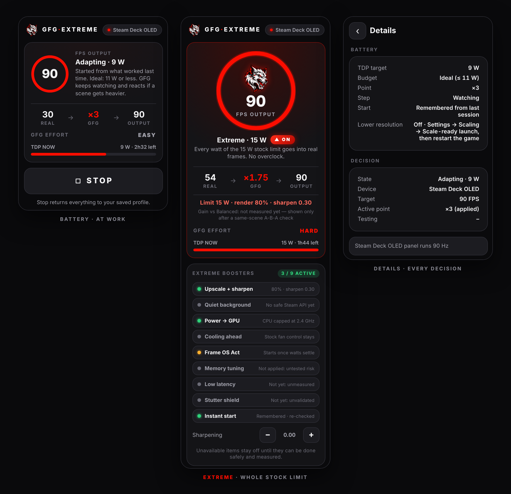
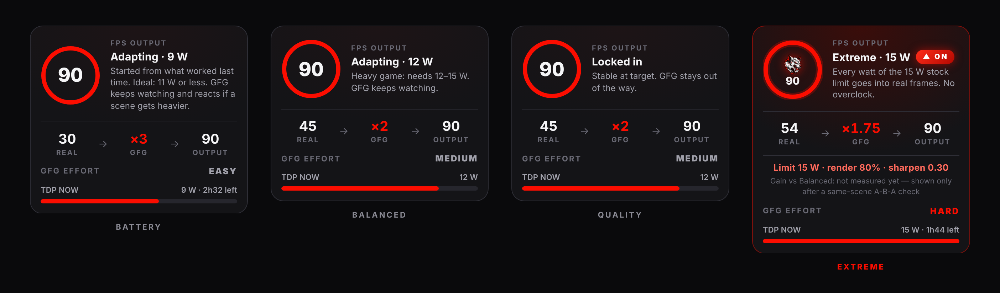
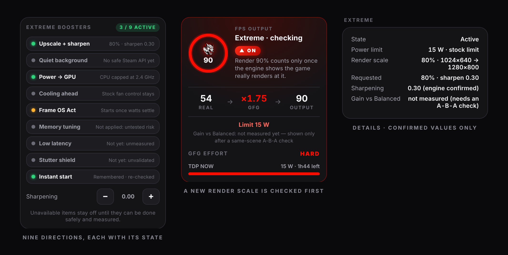
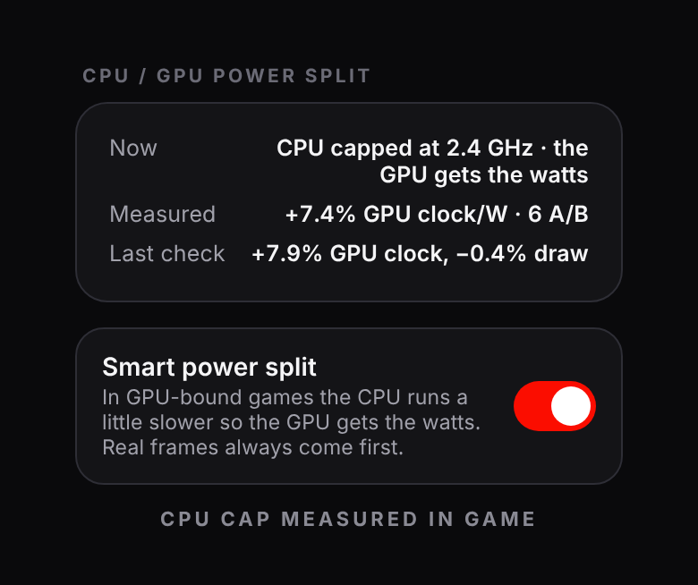
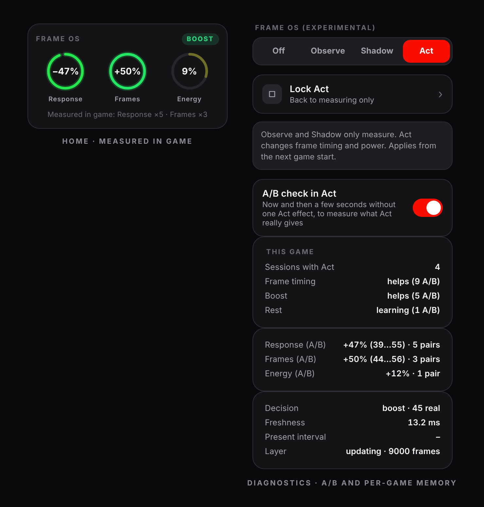
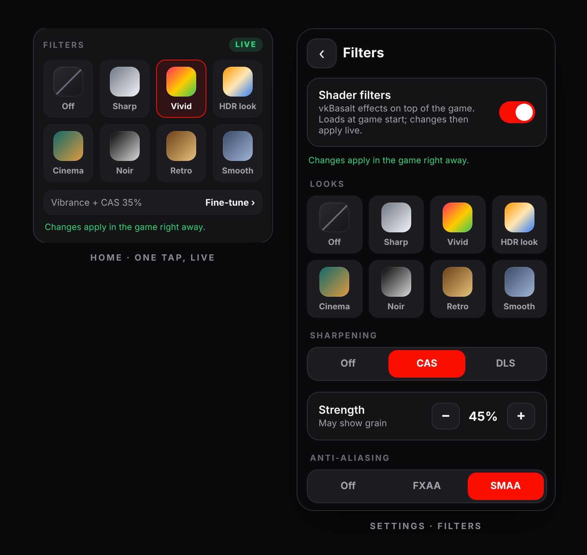
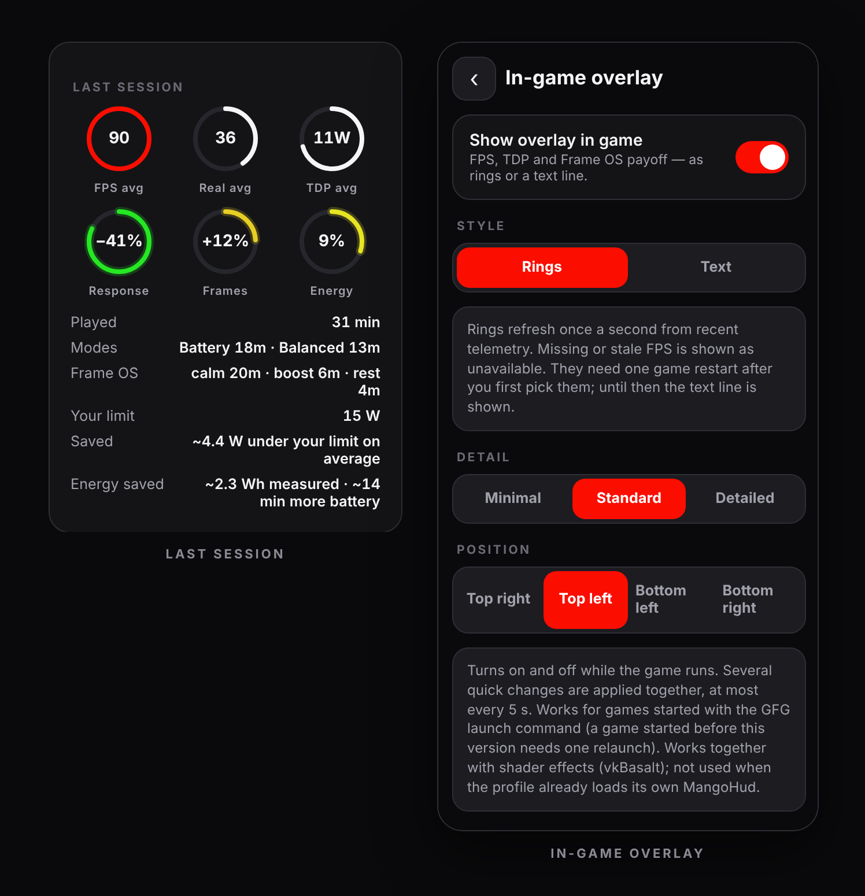
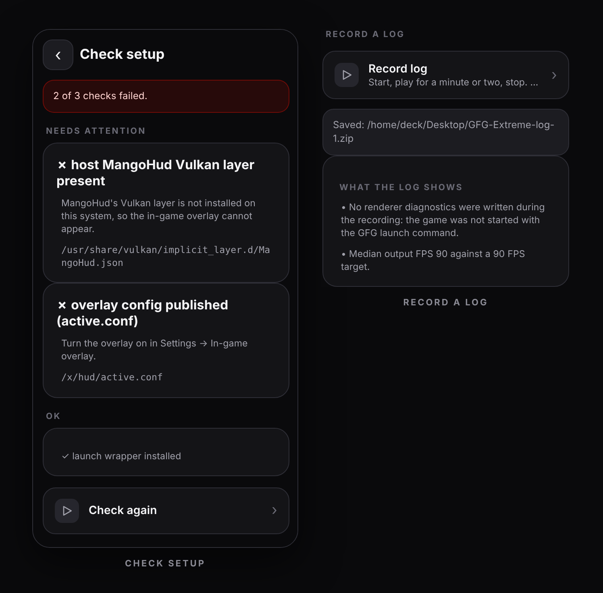

<div align="center">

[English](README.md) · **Русский**


# GFG Extreme

**Генерация кадров и автоматическое управление мощностью для Steam Deck.**<br>
Плагин для Decky Loader. Он генерирует кадры до частоты вашего экрана, подбирает коэффициент генерации и лимит мощности под конкретную игру и проверяет каждое изменение по данным самого рендерера.

[**Скачать последний релиз**](https://github.com/wavessevaw/GFG-Extreme/releases/latest) · [Установка](#установка) · [Режимы](#режимы) · [Extreme](#extreme) · [Если что-то не работает](#если-что-то-не-работает)


<br>



<sub>Плагин в меню быстрого доступа: режим Battery в работе, режим Extreme и страница Details. Снято с настоящего интерфейса на примерных данных.</sub>

</div>

---

## Что он делает

Экран Steam Deck OLED показывает 90 кадров в секунду, а требовательные игры рендерят намного меньше. GFG Extreme заполняет разницу сгенерированными кадрами и держит APU на минимальной мощности, при которой картинка не страдает. Например, игра рендерит 30 настоящих кадров, GFG догенерирует остальные до 90, а APU работает на 9 Вт вместо 15.

Нажмите **Run** на главном экране плагина, дальше Governor работает сам:

- **Цель берётся из экрана.** OLED — 90 FPS, LCD — 60 FPS, док или внешний монитор — 60 FPS. Если снизить частоту встроенного экрана, цель снизится вместе с ней.
- **Коэффициент и мощность вместе.** Governor выбирает, сколько кадров генерировать (от ×1 до ×3,75), и лимит TDP — для этой игры и этой сцены.
- **Каждое изменение проверяется.** Новая настройка засчитывается только после подтверждения свежими данными рендерера, а меньшее разрешение — только когда рендерер сообщит, что игра действительно рендерит в нём. Иначе изменение откатывается за секунды. Некоторые игры всегда рендерят в полном размере; GFG это замечает и больше не пробует для них меньшее разрешение.
- **Подстройка не прекращается.** Когда сцена тяжелеет, Governor добавляет ватты или сгенерированные кадры примерно за две секунды. Пока игра держится, он снова ищет более экономную настройку.
- **Игры запоминаются.** Следующая сессия начинается с того, что сработало в прошлый раз. **Settings → Diagnostics → Reset what GFG learned** сбрасывает выученное для одной игры.
- **Всё видно.** На главном экране — настоящие и выходные кадры, коэффициент, TDP, что ограничивает игру (GPU, CPU, мощность или нагрев) и насколько GFG сейчас загружен работой. В **Details** — каждое решение.

Сохранённый профиль никогда не изменяется. **Stop** возвращает всё как было.

Работает с играми Steam, а через поддержку Flatpak — с Heroic, Lutris и эмуляторами.

## Режимы

<p align="center"></p>

| Режим | Настоящие кадры | Мощность | Для чего |
|---|---|---|---|
| **Battery** | от 24 | идеально 9–11 Вт, больше только в крайнем случае | максимум времени игры |
| **Balanced** | от 30 | старт с 12 Вт, никогда выше обычного диапазона | более ровная картинка |
| **Quality** | сколько получится | снижается после того, как выбрано качество | игра на зарядке |
| **Extreme** | сколько позволяет лимит, от 30 | весь штатный лимит: 15 Вт или ваш более низкий | максимум настоящих кадров от батареи |

Режим задаётся для каждого игрового профиля, и его можно переключать прямо во время игры.

## Extreme

<p align="center"></p>

Battery и Balanced ищут минимальную мощность, которую выдерживает игра. Extreme делает наоборот: тратит весь штатный лимит мощности Deck на настоящие кадры. Работает на обычном Deck — без разгона и без изменений BIOS.

- **Один потолок мощности.** 15 Вт или ваш собственный более низкий лимит из меню быстрого доступа, никогда больше. Под этот потолок попадает каждая запись мощности, включая подъёмы Frame OS Act. Если изменить лимит во время игры, новое значение станет потолком.
- **Разрешение рендера как обмен.** Там, где это даёт больше настоящих кадров, Extreme рендерит в 90 % или 80 % и подбирает резкость (0,15 при 90 %, 0,30 при 80 %). Резкость можно поправить на ±0,3 на главном экране. Меньшее разрешение не используется в играх, упирающихся в процессор, и поверх собственного масштабирования профиля, а резкость не добавляется, если её уже повышает ваш фильтр vkBasalt.
- **Подтверждено или откат.** Новый масштаб засчитывается только после того, как рендерер сообщит реальный размер, в котором рендерит игра. Без этого изменение откатывается за 20 с. После двух промахов Extreme до конца сессии остаётся в полном разрешении.
- **Один перезапуск.** Скейлер загружается при старте игры. После переключения игры на Extreme перезапустите её один раз, чтобы стали доступны меньшие разрешения. До этого Extreme работает в полном разрешении и прямо об этом пишет.
- **Frame OS Act — по согласию.** При первом включении Extreme один раз спросит, можно ли подключить Act. При выходе из Extreme вернётся прежняя настройка Frame OS.

На главном экране перечислены девять направлений, на которых построен Extreme, у каждого — текущее состояние и причина:

| Направление | В 1.6 |
|---|---|
| Масштаб рендера + резкость | работает, когда рендерер подтверждает масштаб |
| Мощность CPU → GPU | работает (умное распределение мощности, см. ниже) |
| Frame OS Act | работает после вашего согласия, когда мощность устоялась |
| Мгновенный старт | запомненная точка для каждой игры, перепроверяется при старте |
| Тишина в фоне | недоступно: у Steam нет поддерживаемого API для отдельных задач, а останавливать Steam GFG не будет |
| Охлаждение на опережение | недоступно: нет проверенного интерфейса вентилятора; управляет штатный контроллер |
| Настройка памяти | недоступно: глобальные настройки памяти не меняются без тестов под нагрузкой и восстановления |
| Минимальная задержка | недоступно: ещё не измерено на железе |
| Щит от фризов | недоступно: ещё не проверено на железе |

Прирост относительно Balanced пока не показывается числом. Для этого нужно сравнение A-B-A на одной и той же сцене, оно запланировано. Средние значения разных сессий — не сравнение.

Battery и Balanced предлагают Extreme, когда игра оставляет часть лимита мощности неиспользованной.

## Умное распределение мощности

<p align="center"></p>

У CPU и GPU в Steam Deck один общий лимит мощности. В игре, упирающейся в видеокарту, процессор всё равно разгоняется до полной частоты между кадрами и забирает ватты, которые пригодились бы GPU. GFG ступенями снижает максимальную частоту CPU и отдаёт эти ватты видеокарте:

- **Только там, где это помогает.** Игра должна упираться в GPU или в лимит мощности, а у самого загруженного ядра CPU должен оставаться запас и на более низкой частоте.
- **Маленькими шагами.** 3,5 → 3,0 → 2,4 → 2,1 → 1,8 ГГц, никогда ниже 1,6 ГГц и никогда выше вашего собственного лимита. Каждый шаг — проба на 10 секунд.
- **Настоящие кадры важнее.** Если настоящих кадров становится меньше или ядро загружается, ограничение снимается сразу. Экраны загрузки, меню Steam и Frame OS Act всегда работают на полной частоте CPU.
- **Измеряется в вашей игре.** Короткие A/B-проверки сравнивают частоту GPU на ватт с ограничением и без. Если в игре разница не измеряется, распределение для неё выключается.
- **Всегда возвращается.** Ваш лимит CPU возвращается при выходе из игры, по Stop и при выгрузке плагина, в том числе после сбоя. Если частоту CPU задаёт другая программа, GFG её не трогает. Выключить можно в **Details → Smart power split**.

## Frame OS (экспериментально)

<p align="center"></p>

Frame OS — небольшой слой Vulkan над генератором кадров. Он видит каждый настоящий кадр и ввод с контроллера и подстраивает частоту настоящих кадров под момент. Включается в **Settings → Diagnostics → Frame OS** и загружается при следующем запуске игры.

- **Observe** и **Shadow** только измеряют и показывают, что сделал бы Frame OS.
- **Act** меняет тайминг кадров и мощность (нужна явная разблокировка):
  - Когда вы поворачиваете камеру или деретесь, поднимает частоту настоящих кадров, если GPU может их выдать (например, ×3 → ×2, 45 настоящих кадров при 90 Гц).
  - В паузах и меню снижает лимит мощности.
  - Подаёт настоящие кадры так, чтобы они меньше ждали внутри генератора (на Deck измерено: примерно с 25 до 13 мс).
  - Отдыхает, пока игру закрывает меню Steam, и возвращает управление, когда APU перегревается или выходных кадров не хватает.
- **Проверяется в вашей игре.** В режиме Act Frame OS ненадолго выключает один эффект и сравнивает один и тот же момент до, во время и после (A-B-A). После трёх сравнений на главном экране показываются измеренные **Response**, **Frames** и **Energy**.
- **Запоминается для каждой игры.** Эффект, который в игре не помогает, для неё выключается и раз в восемь сессий пробуется заново.

## Фильтры

<p align="center"></p>

Шейдерные фильтры (vkBasalt) поверх игры, выбираются из меню быстрого доступа:

- Восемь образов, каждый в одно касание: Sharp (CAS), Vivid, HDR look, Cinema, Noir, Retro, Smooth (SMAA) или Off.
- Когда фильтры загружены, новый образ применяется прямо в запущенной игре. Фильтры загружаются при старте игры; карточка подскажет, если сначала нужен перезапуск.
- **Settings → Filters**: резкость (CAS или DLS) и её сила, сглаживание (FXAA или SMAA) и 19 эффектов, которые работают в том порядке, в каком вы их включили.
- Каждый игровой профиль хранит свой образ. Эффекты стоят времени GPU; с включённым Governor тяжёлый набор может означать чуть больше мощности или более глубокий коэффициент.

## В игре и после игры

<p align="center"></p>

Оверлей в игре показывает выходные FPS с частотой настоящих кадров под ними, TDP, оставшееся время батареи в режиме Detailed и кольца Frame OS, если он включён. Обновляется раз в секунду и рисуется собственным слоем Vulkan GFG после генератора кадров. В приложениях Flatpak, в играх с HDR и до первого перезапуска после выбора колец вместо них показывается текстовая строка:

`90 FPS  x3  (30)  sc100  TDP 9W  APU 8W  2h32  easy`

<p align="center"></p>

Когда игра закрывается, главный экран подводит итог сессии: средние FPS, настоящие кадры и TDP, время в каждом режиме и состоянии Frame OS, сэкономленная энергия относительно вашего лимита — в Вт·ч по измеренному потреблению и в минутах батареи. В **Details** хранятся последние сессии. В **Settings → In-game overlay** выбираются вид (кольца или текст), подробность и угол экрана.

## Установка

Нужны [Decky Loader](https://decky.xyz/) и [Lossless Scaling](https://store.steampowered.com/app/993090/Lossless_Scaling/) из Steam (обычная публичная версия).

1. Скачайте свежий `GFG-Extreme-v*.zip` из [Releases](https://github.com/wavessevaw/GFG-Extreme/releases/latest) и установите его в Decky через *Install from zip*. Разрешите доступ root: он нужен только для записи лимита мощности и ограничения частоты CPU.
2. Откройте GFG Extreme и нажмите **Install engine**.
3. В Steam откройте **Свойства → Параметры запуска** игры и вставьте:
   ```text
   /home/deck/.local/bin/gfg %command%
   ```
   Пока игра не подключена, GFG показывает эту команду с кнопкой **Copy**.
4. Запустите игру и нажмите **Run**.

Heroic, Lutris, EmuDeck и другие приложения Flatpak: включите GFG для приложения в **Settings → System**.

Чтобы обновиться, установите новый zip поверх старого. Настройки, профили и выученное GFG сохраняются. Запущенную игру перезапустите, чтобы загрузились новые слои.

## Что меняет GFG и как возвращает

- **Сохранённый профиль** не записывается никогда. Governor работает через временный overlay, который лаунчер читает, только пока работает плагин.
- **Лимит мощности** захватывается только на время игры под Governor, никогда не превышает потолок режима и возвращается по Stop, при выходе из игры и при выгрузке плагина. Если лимит меняет другая программа, GFG перестаёт писать и не восстанавливает своё значение поверх чужого.
- **Ограничение частоты CPU** — по тем же правилам; после сбоя ваше значение возвращает файл-маркер.
- **Никакого разгона, изменений BIOS или прошивки, никакого андервольтинга.**
- Привилегированный помощник принимает только файлы лимита мощности и частоты CPU и проверяет допустимые значения.

## Если что-то не работает

<p align="center"></p>

1. **Settings → Diagnostics → Check setup** проверяет движок, лаунчер, оверлей, журнал диагностики и доступ к TDP и для каждой ошибки говорит, что исправить.
2. **Запишите лог:** Settings → Diagnostics → **Record log**, поиграйте минуту-две, затем **Stop**. На рабочем столе Steam Deck появится zip с понятным `summary.txt`. [Откройте issue](https://github.com/wavessevaw/GFG-Extreme/issues) и приложите его.

## Статус

Текущий релиз — **1.6**. Battery, Balanced и Quality стабильны. Extreme — первая ступень и пока проверен на немногих играх. Frame OS экспериментальный и выключен, пока вы его не включите.

Каждый релиз проходит автоматические тесты (Python-бэкенд, сгенерированный лаунчер в bash, интерфейс в headless-браузере). Логи из других игр и конфигураций очень помогают. Известные ограничения: [docs/GFG_GOVERNOR_KNOWN_LIMITATIONS.md](docs/GFG_GOVERNOR_KNOWN_LIMITATIONS.md).

Последние версии:

- **1.6** — режим Extreme: единый потолок мощности, масштаб рендера с подтверждением от рендерера, честный список возможностей.
- **1.5** — умное распределение мощности, фильтры на главном экране, компактный главный экран.
- **1.3** — Frame OS проверяет свои эффекты в игре и запоминает каждую игру.

Все подробности: [Releases](https://github.com/wavessevaw/GFG-Extreme/releases).

<details>
<summary><b>Другие возможности</b></summary>

- Профили для каждой игры, выбираются автоматически по Steam app ID или имени процесса.
- Генерация кадров через **GFG Engine**, **OptiScaler**, **встроенную в игру** или **Off**. Пространственное масштабирование и шейдеры vkBasalt от неё не зависят. С внешним бэкендом GFG только наблюдает.
- **Pipeline Inspector**: Saved, Effective, Governor и то, что реально загрузил запущенный процесс.
- **Configuration Journal** с безопасным восстановлением и **All settings** для каждой настройки движка.
- Совместимость с Gamescope WSI, MangoHud, расширения среды Flatpak и доступ для отдельных приложений.

</details>

<details>
<summary><b>Для разработчиков</b></summary>

```bash
npm ci
npm test              # тесты бэкенда, сборка фронтенда, smoke-тест интерфейса
npm run build         # frontend/ → dist/index.js (CI падает, если он устарел)
npm run screenshots   # перерисовать docs/img с настоящего интерфейса
python3 tools/gfg_log_report.py <log.zip>   # прочитать записанный лог на ПК
```

Документация: [Архитектура Governor](docs/GFG_GOVERNOR_ARCHITECTURE.md) · [Основа Extreme](docs/EXTREME_FOUNDATION.md) · [Телеметрия](docs/GFG_TELEMETRY_CAPABILITIES.md) · [Интерфейс](docs/GFG_UI_REDESIGN.md) · [Frame OS](docs/GFG_FRAME_OS.md). Каждое слияние в `main` с новой версией автоматически публикует релиз.

</details>

## Благодарности

GFG Extreme продолжает работу **MAKO** и **lsfg-vk**. Он наследует [Decky LSFG-VK Experimental](https://github.com/eugeniosegala/decky-lsfg-vk-experimental), а встроенный движок основан на проекте MAKO, который приносит в Linux генерацию кадров LSFG, пространственное масштабирование и шейдерные эффекты. Спасибо их авторам. GFG Extreme не содержит и не распространяет Lossless Scaling; исходные имена `mako-*` сохранены там, где этого требует совместимость с рендерером.

GPL-3.0-or-later · [Лицензия](LICENSE.md) · [Сторонние компоненты](THIRD_PARTY_NOTICES.md)
